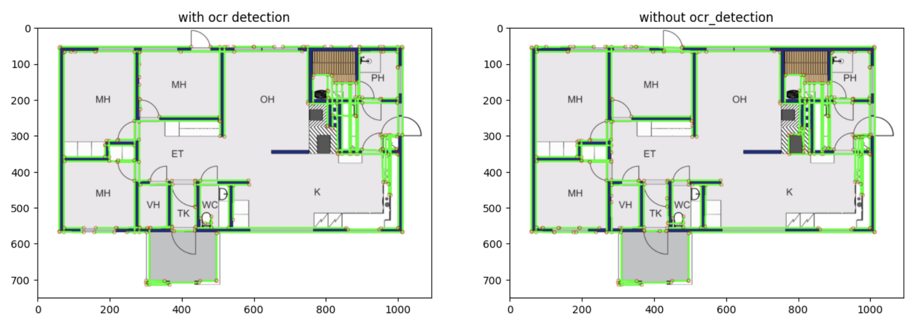
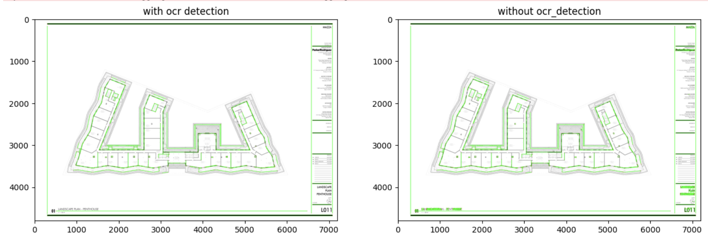
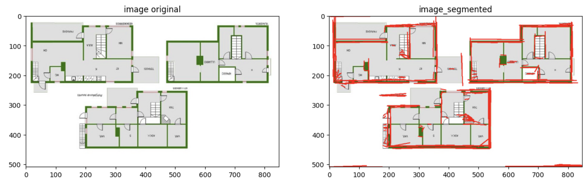
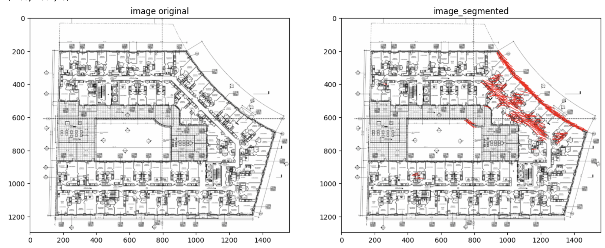
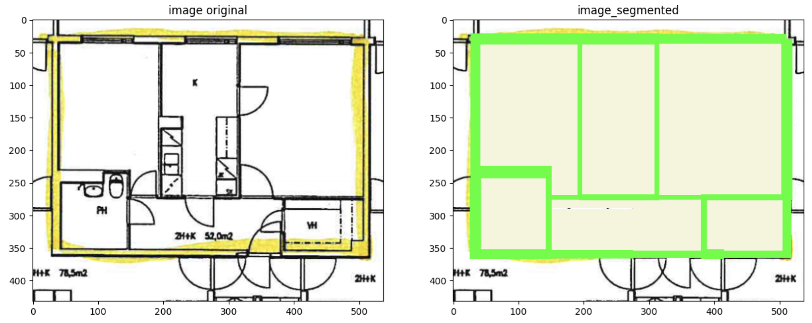
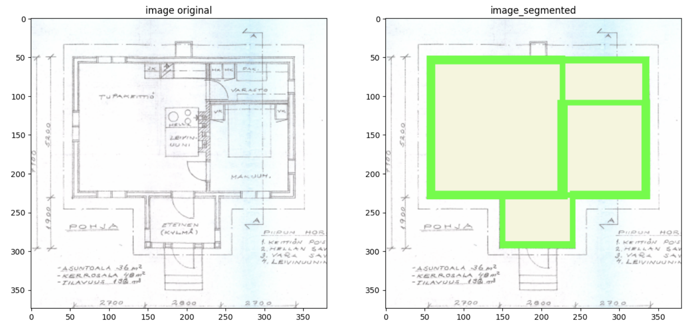

# Machine Learning Engineer Test: Computer Vision and Object Detection

## Goal
This project focuses on three main tasks:
* Wall Detection using Traditional Computer Vision Techniques: Develop an initial approach for detecting walls through classic image processing and computer vision methods.
* Dataset Creation and Model Training: Leverage the first approach to generate a dataset for training a YOLOv8 Pose model (keypoint detection) and apply this model for enhanced wall detection.
* Segmentation-Based Wall and Room Detection: Utilize a pre-trained segmentation model, based on the CubiCasa5k dataset, to identify both walls and rooms.

### Wall Detection using Traditional Computer Vision Techniques

In this step, I employed classic techniques such as threshold binarization and morphological transformations to process images, allowing for the detection of individual components. This enables the extraction of straight lines representing walls. Additionally, I have incorporated Optical Character Recognition (OCR) to eliminate text noise in the images, ensuring that only the walls are identified against the white background.

This approach serves as a solid foundation, but it requires careful adjustment of numerous parameters, as each image will necessitate its own specific configuration to achieve optimal results. Consequently, we may face challenges in detecting walls across a variety of images.

PS: While I have implemented the OCR functionality for local use, it is not included in my API server. I chose EasyOCR as my OCR engine due to its superior text detection performance compared to other open-source alternatives like Tesseract. However, this high performance comes at the cost of significant memory and processing requirements. Therefore, I encountered challenges running it smoothly on the server without a GPU.

To view the results and examples, please access the floor_plan/03-test_classical_detection.ipynb file.




### Yolo V8

To train a YOLO model for wall detection, I took the previous approach to identify walls and generate labels within the CubiCasa5k dataset. These labels consist of bounding boxes and keypoints, which represent the start and end points of the straight walls.

As I mentioned earlier, classical techniques present several challenges, and creating labels based on this data may not yield a consistent dataset. Due to the immaturity of the approach, the generated labels may fail to identify all the walls in the images, potentially leading to confusion for the model.

The generated model is far from perfect, but it demonstrates that it has grasped the core principles of the problem we aim to address, as evidenced by its ability to detect some walls.

PS: I attempted to implement the YOLO model for segmentation, however, the keypoint detection approach yielded the best results with the available data.

PS2: I did not perform any threshold optimization here. I plotted everything the model identified as a wall, setting the minimum confidence to zero.

To view the results and examples, please access the floor_plan/03-test_yolo_detection.ipynb file.




### CubiCasa5k segmentation model

To test the implementation of a mature model, I used the pre-trained CubiCasa5K model, which is designed to detect walls, rooms, and icons such as doors and windows. This model performs well and provides a good repository for developing other models based on its principles.

To view the results and examples, please access the floor_plan/03-test_cc5k_detection.ipynb file.




## Running the server

The project is located in the floor_plan folder.

First, download the weights from the following link: (https://drive.google.com/drive/folders/1tLHiy0TeqVJne7CBitqOYPJ4wwO9_VzN?usp=sharing). Save the weights in the floor_plan/models/weights directory.

First, build Docker image:
```
docker build -t fastapi-inference .
```

Then, run the container:
```
docker run -d -p 3000:3000 fastapi-inference
```

### To run the inferences:

Classic computer vision technique:
```
curl -X POST -F "image=@extracted_page_xyz.png" "http://localhost:3000/inference-run-classic --output output_image_classic.jpg"
```

Yolo v8 keypoints detection technique:
```
curl -X POST -F "image=@extracted_page_xyz.png" "http://localhost:3000/inference-run-yolo --output output_image_yolo.jpg"
```

CubiCasa5k pre trained model technique:
```
curl -X POST -F "image=@extracted_page_xyz.png" "http://localhost:3000/inference-run-cc5k --output output_image_cc5k.jpg"
```
